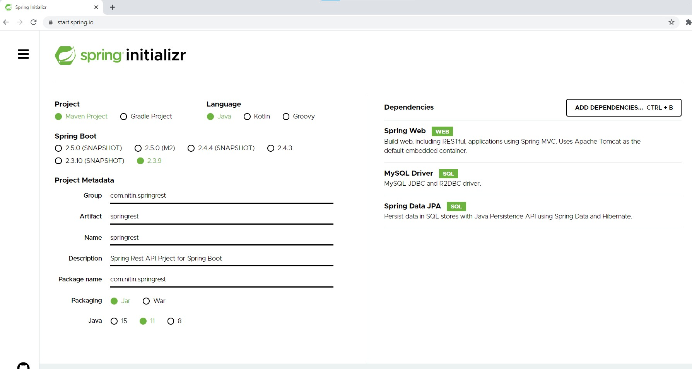

### Software Requirements :

- Postman
- IntelliJ Idea
- Java 11
- MySQL Client 


- go to Spring Initializer and create project as follows



- import project in IntelliJIdea and it will take time to install all maven dependencies.

- go to SpringrestApplication.java => Right Click and run Application

- Encountered following error: 
```text
2021-03-13 21:22:18.133  WARN 18756 --- [           main] ConfigServletWebServerApplicationContext : Exception encountered during context initialization - cancelling refresh attempt: org.springframework.beans.factory.UnsatisfiedDependencyException: Error creating bean with name 'org.springframework.boot.autoconfigure.orm.jpa.HibernateJpaConfiguration': Unsatisfied dependency expressed through constructor parameter 0; nested exception is org.springframework.beans.factory.BeanCreationException: Error creating bean with name 'dataSource' defined in class path resource [org/springframework/boot/autoconfigure/jdbc/DataSourceConfiguration$Hikari.class]: Bean instantiation via factory method failed; nested exception is org.springframework.beans.BeanInstantiationException: Failed to instantiate [com.zaxxer.hikari.HikariDataSource]: Factory method 'dataSource' threw exception; nested exception is org.springframework.boot.autoconfigure.jdbc.DataSourceProperties$DataSourceBeanCreationException: Failed to determine a suitable driver class
2021-03-13 21:22:18.136  INFO 18756 --- [           main] o.apache.catalina.core.StandardService   : Stopping service [Tomcat]

```

- go to src/main/resources/application.properties and add below: 
```text
spring.autoconfigure.exclude=org.springframework.boot.autoconfigure.jdbc.DataSourceAutoConfiguration
```

- http://localhost:8080/ will give Whitelable Error page so App is running successfully

